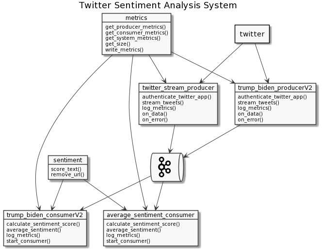

# CSCI-550-FinalProject
## Datamining Final Project

## Start Zookeeper and Kafka from Kafka install directory:
`bin/zookeeper-server-start.sh config/zookeeper.properties`

`bin/kafka-server-start.sh config/server.properties`

## Create a topic
`bin/kafka-topics.sh --create --zookeeper localhost:2181 --replication-factor 1 --partitions 1 --topic twitter`

## Check that topics are being published
`bin/kafka-console-consumer.sh --bootstrap-server localhost:9092 --topic twitter --from-beginning`

## Start the producer
Make sure the topic you enter matches that above
`python twitter_stream_producer.py`

## Start the consumer
Make sure the topic you enter matches that above
`python average_sentiment_consumerV2.py`

# System Diagram

## Performance Specs
| OS             | Processor                       | Memory | Record send rate | Average records per request | Records consumed rate | Average records per request |
| -------------- | ------------------------------- | ------ | ---------------- | --------------------------- | --------------------- | --------------------------- |
| MacOS Catalina | 3.1 GHz Quad-Core Intel Core i7 | 16GB   | 40.06            | 1.02                        | 565.41                | 162.05                      |